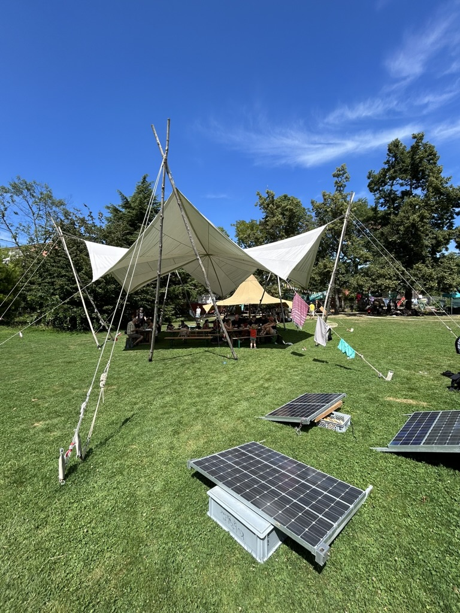
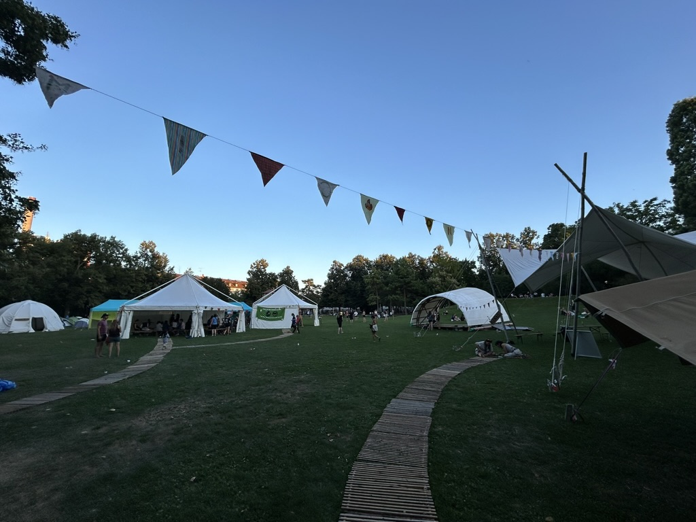
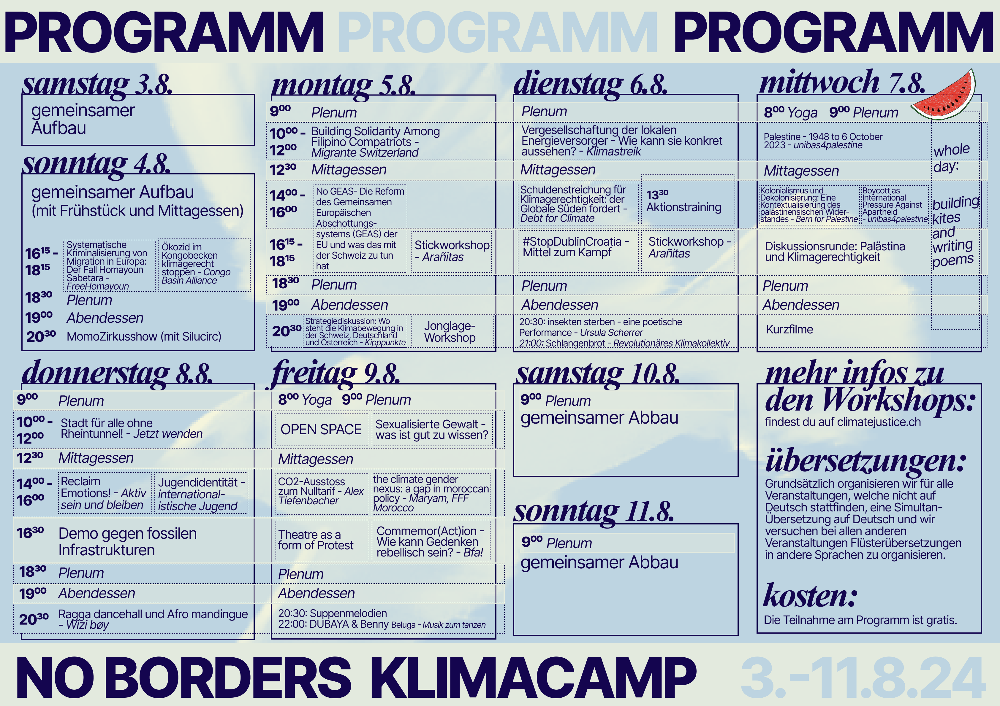
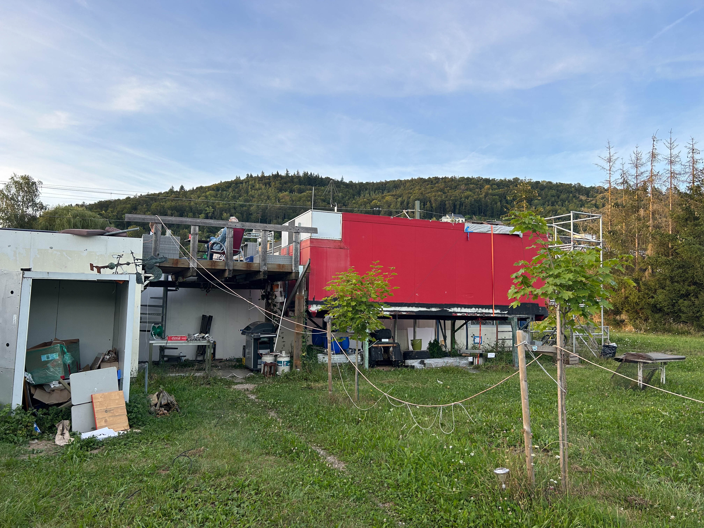
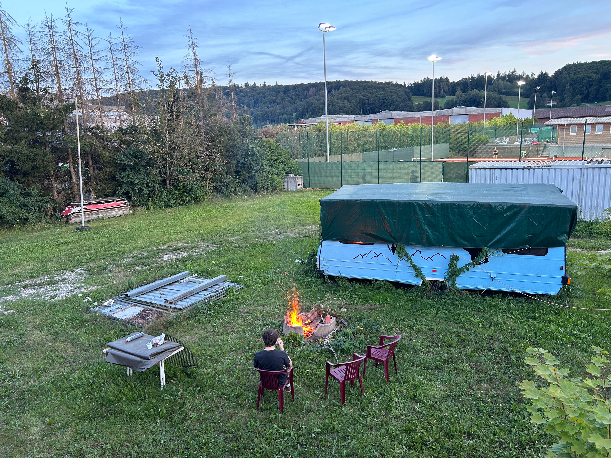
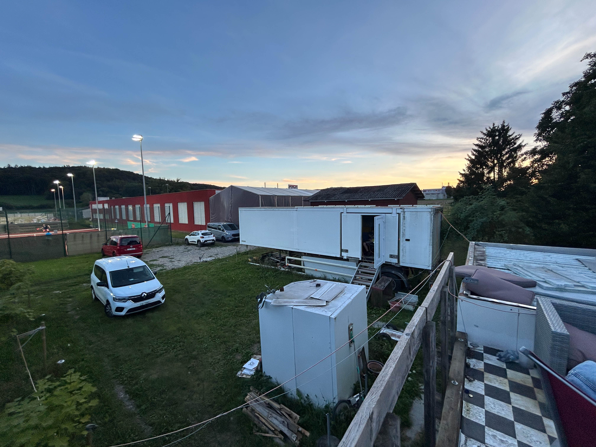
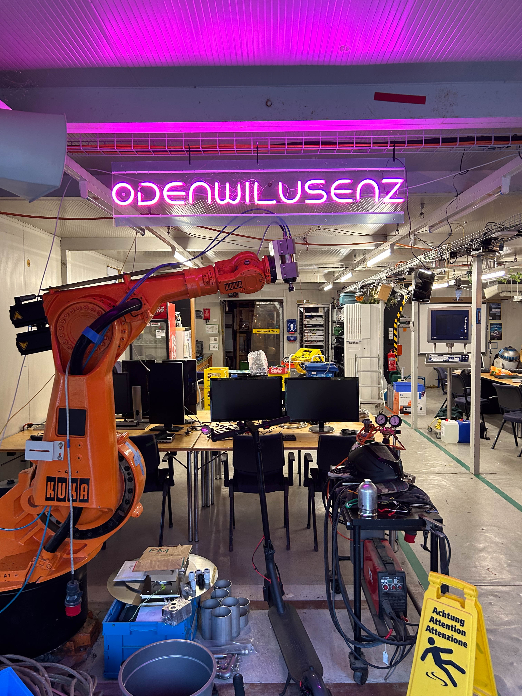
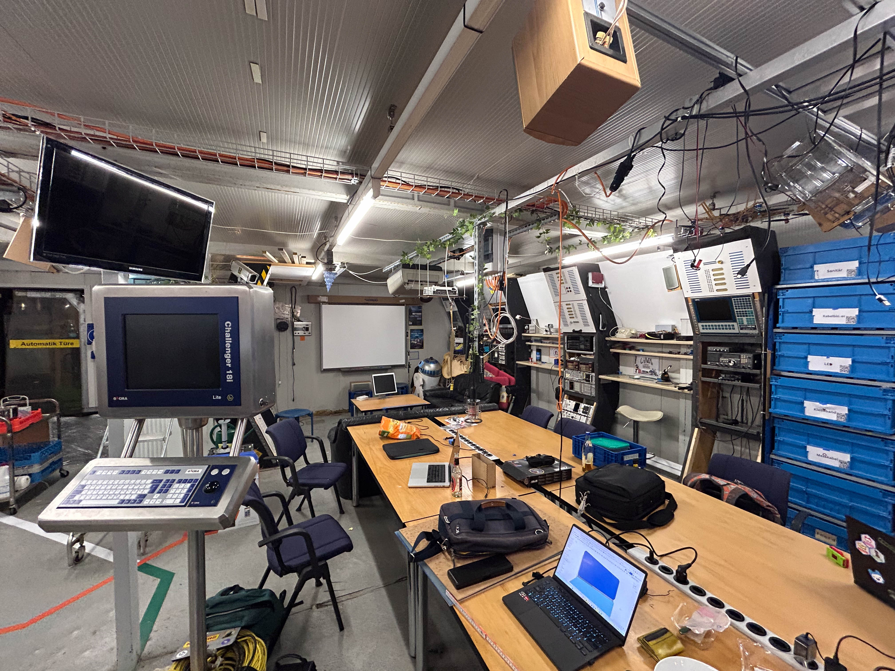
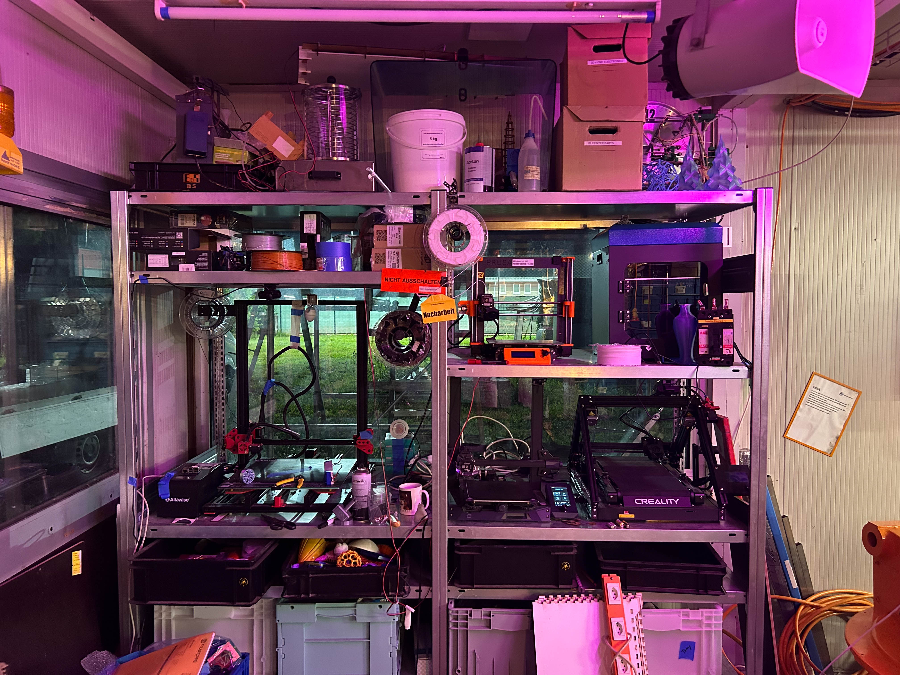
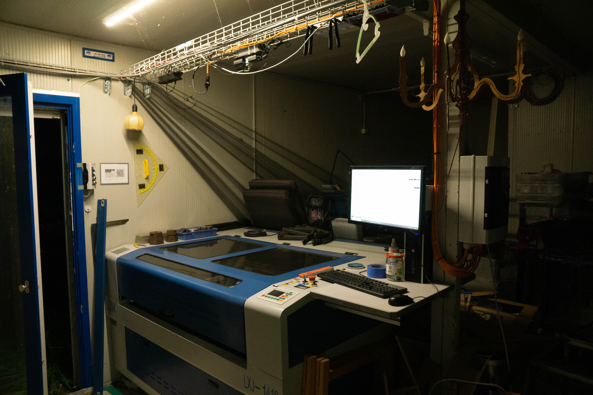

Working Title

# Hacking Culture & Digital Degrowth

## Abstract

[...]

## 1 - Introduction

[...]

### 1.1 - Research Question

In my research project I want to tackle the following questions:

- How can hacking culture contribute to a Degrowth transformation?
- How do grassroot movements in (and around) Switzerland reuse old electronics to explore alternatives futures for a Degrowth transformation?

### 1.2 Research approach

By starting with analysing hacking culture and hackerspaces I am approaching the topic of electronics reuse from the margins. This approach is built on the hypothesis that that practices of these communities can help to derive lessons that may be relevant for the whole digital sector.

[...]

### 1.3 Methodology

I am using a combined approach as methodology for this research. The theoretical basis is built from literature review of different relevant literature dealing with Degrowth and it's relation to technology as well as literature about transformative aspects of hacking culture. In the field research part I am visiting different hackerspaces across Switzerland and interviewing different people working with old electronics as well as observing and documenting the place with pictures. Additionally I draw information from online available resources such as blogs and wikis of the hackerspaces.

[...]

## 2 - Digital Degrowth

Definition of Degrowth (degrowth.info)

> “Degrowth is an idea that critiques the global capitalist system which pursues growth at all costs, causing human exploitation and environmental destruction. The degrowth movement of activists and researchers advocates for societies that prioritize social and ecological well-being instead of corporate profits, over-production and excess consumption. This requires radical redistribution, reduction in the material size of the global economy, and a shift in common values towards care, solidarity and autonomy. Degrowth means transforming societies to ensure environmental justice and a good life for all within planetary boundaries.”

Digital Technology is one of the main drivers of current economic growth.

[...]

## 3 - Field research

During the summer semester break I visited the summer camp of the Swiss climate movement in Basel for multiple days as well as a Hackerspace in Schaffhausen for two evenings and the Chaostreff in Berne for one evening.  I talked to a lot of different people and did two formal (recorded) interviews in the Hackerspace Schaffhausen. 

## 3.1 - Climate Camp Basel

## 3.2 Hackerspace Odenwilesenz

The Odenwilusenz is an (anarchistic) hackerspace in Schaffhausen that exists since 2007 and relocated to the current place on a meadow near the train station in Beringen in 2017. It is part of the Chaos Computer Club Switzerland.

The structure is made from repurposed containers from a former temporary Volg store in a neighboring village. The hackerspace was built with a lot of volunteer work including leveling the field, installing connections, pipes, sewage systems, electricity, etc., often through DIY efforts. 

A metal staircase leads up to a rooftop terrace on top of the containers. There are two caravans and one container in the garden, which are rented out to members at an very affordable rate for living, working, or workshop / experiment space.

## 3.3 Analysis

In first step of analysis I extracted all topics that came up in the interviews and tried to create a map, which shows me an overview of the complex of themes and visualizes how they are connected. The more connnected topics are the visually closer they appear on my map:

## 4 - Discussion

[...]

## 5 - Conclusion

[...]

## 6 - Bibliography

[...]

## 7 - Appendix

### Field research guide (Old version)

**General research question**

A) How can (creative) reuse / reappropriation of old electronics contribute to a degrowth transformation?

B) How can low-tech IT infrastructure contribute to a degrowth transformation?  
 (Decision between question A and B still work in progress)

**Field Research**

The role of low tech IT in grassroot movements

- How do (grassroots) movements in (and around) Switzerland build low-tech IT infrastructures to explore alternatives futures for a Degrowth transformation?
- What social and design implications do these low-tech approches have?
- How is low-tech IT politically pushed by grassroots?

**Sampling Strategy**

Starting from organizations / movements, then snowball sampling (recommendations from interviewees)

- Climate Movement (Climatestrike) Switzerland
- Chaos Computer Club Meetings
- Hackerspaces
- Pirate Party
- (Repair Café)

**Interview Guide**

**Introduction**

Short research explanation for interviewees:

- I’m researching how the digital sector can transform itself to contribute to a Degrowth transformation. I’m starting from the margins.
- I’m particularly interested in individuals as well as grassroot movements that are exploring alternatives, ranging from building your own parts of a low-tech IT infrastructure, reappropriating old electronics or pushing related ideas politically. Hypothesis that practices of these communities can help to derive lessons that may be relevant for the whole digital sector.
- Degrowth Definition:  
  “Degrowth is an idea that critiques the global capitalist system which pursues growth at all costs, causing human exploitation and environmental destruction. The degrowth movement of activists and researchers advocates for societies that prioritize social and ecological well-being instead of corporate profits, over-production and excess consumption. This requires radical redistribution, reduction in the material size of the global economy, and a shift in common values towards care, solidarity and autonomy. Degrowth means transforming societies to ensure environmental justice and a good life for all within planetary boundaries.”  
  ([www.degrowth.info](http://www.degrowth.info))

**Preparation**

Consent for voice recording? Consent for using quotes (real name or anonymized)  
Explanation: What will interview be used for? Always possible to withdraw a statement.

**Topics**

**Personal (activist) practices**

Do you have an concrete example you might show me?

What (activist) practices do you engage in? How does it contribute to Degrowth?

What are your motivations?

What (multiple) initiatives did you take? What was hard? What were challenges?

What was positive, what negative?

**Opinions regarding IT infrastructure**

What is your logic regarding low tech and IT infrastructure?  
Do you use these terms? If not, why?

**Inspiration**

Which projects / movements inspire you? How do they influence your work? (multiple)

**Boundaries**

Why didn’t you do this or that? (for example setting up your own server, green host, try to make lobbying, blow up / hacking an commercial server, …)

Which ideas / projects did you discard? Why?

**Future**

How do you see the future of low tech / hacking spaces / your work? What are your next steps?

If time, people and budget wouldn’t be a concern, what would you do?

**Further contacts**

Do you know other people active in this field?

**Finalization**

Agreement to take a picture of person?  
(Picture will be transformed in Photoshop so it looks hand drawn)  
 Name / Nickname to put in paper?

Contact possibility?

**Evaluation**

thematic analysis of the interviews